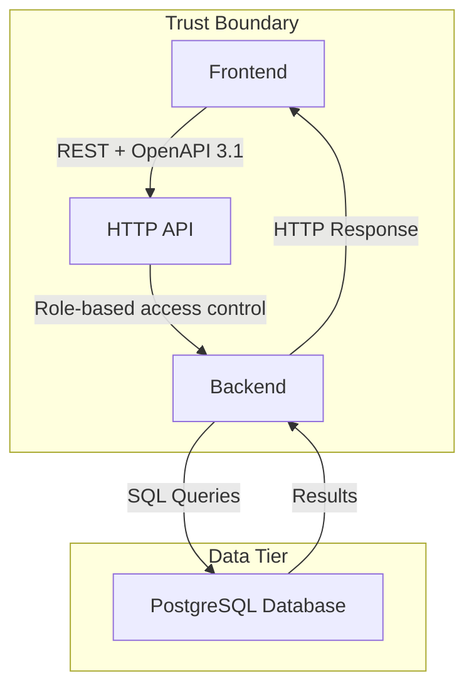

# Architecture overview

Approved by **u.architect**.

## The approved diagram

## Decisions behind it

_No architecture decisions were recorded._

## Notes

The SQL Assistant is a full-stack web application that allows users to ask questions in plain English and receive answers along with the generated SQL. The frontend communicates with the backend via an HTTP API, which uses FastAPI and PostgreSQL for data storage. Observability is provided through OpenTelemetry traces and metrics.
